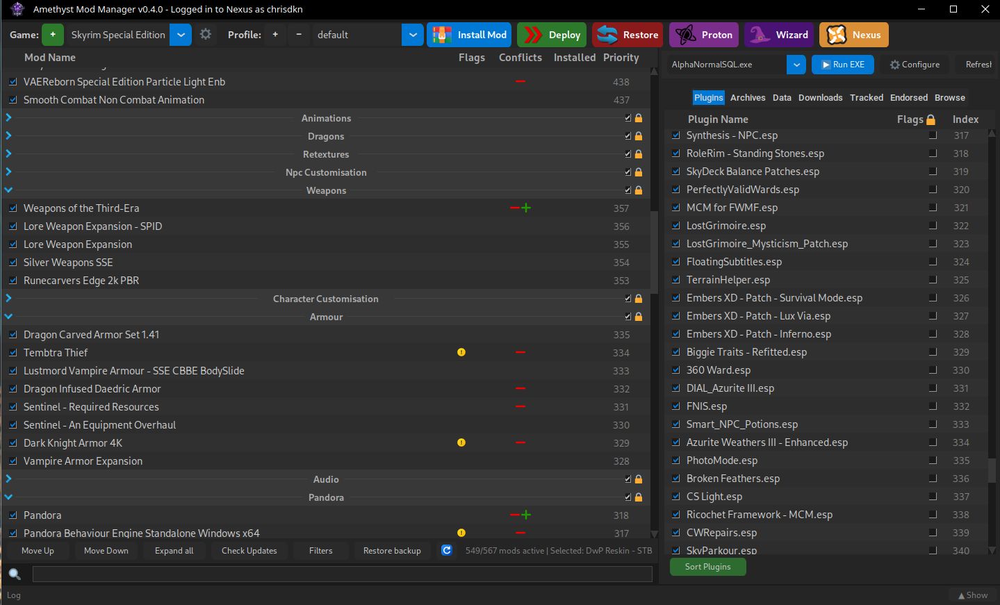

<p align="center">
    
</p>
<h1 align="center">Amethyst Mod Manager</h1>

<h3 align="center">A mod manager for Linux.</h3>

<p align="center">
    
</p>

## Key Features

- **Mod Organiser like interface** - Designed to look and behave like Mod Organiser
- **Linux Native** — Designed for Linux
- **Multi-game support** — Support for many games
- **FOMOD support** — Full Fomod support with last selections saved.
- **LOOT support** — Plugins for games that use LOOT can be sorted using LOOT.
- **Nexus API Support** — Integration with features provided by the Nexus Mods Api

## Install

Run the following command in a terminal. It will appear in your applications menu under Games and Utilities.
**The Application may ask to set a password, This is for the OS keyring to store your nexus API key as we do not store it in a plain text file. Set the password to anything you want**

```bash
curl -sSL https://raw.githubusercontent.com/ChrisDKN/Amethyst-Mod-Manager/main/src/appimage/Amethyst-MM-installer.sh | bash
```

## Games Supported

- Skyrim (Normal, SE and VR)
- Fallout 3 (Normal and Goty)
- Fallout 4 (Normal and VR)
- Fallout New Vegas
- Starfield
- Oblivion
- Baldur's Gate 3
- Witcher 3
- Cyberpunk 2077
- Mewgenics
- Stardew Valley
- Kingdom Come Deliverance (1 and 2)
- Subnautica
- Subnautica Below Zero
- The Sims 4
- Tcg Card Shop Simulator
- Lethal Company

## Usage

1. Add a game with the **+** icon in the top left.
2. It should auto-detect your install path and Proton prefix, but you can change these if needed.
3. Change the staging directory if you wish — this is where your mods are stored.
4. Use the **Install Mod** button to install a new mod.  
   Optionally, you can install from the Downloads tab if the mod is in your downloads folder.
5. Sort your mods in the mod list panel. You can add separators to group them.
6. If using a LOOT-supported game, you can sort and move plugins in the Plugins tab.
7. Click **Deploy** to move the mods to the game folder, or **Restore** to undo this.
8. Run the game via your normal method, Steam/Heroic/Lutris. You can also run the game in the top right with the run exe button.

You can also add multiple profiles with different configurations — simply create/swap to that profile and deploy it.

## Supporting Applications

The manager supports many supporting applications used to mod games. Place the applications in the games applications folder and they will be auto detected. The arguments/config used to run them will be auto-generated to make setup easier.

| Status | Application | Notes |
|--------|-------------|-------|
| Working | **Pandora Behaviour Engine** | `--tesv:` and `--output:` args |
| Working | **SSEEdit** | `-d` and `-o` args |
| Working | **pgpatcher** | Requires `d3dcompiler_47` installed to the game prefix via Protontricks |
| Working | **DynDOLOD** | `-d` and `-o` args |
| Working | **TexGen** | `-d` and `-o` args |
| Working | **xLodGen** | `-d` and `-o` args. Game argument appended at runtime |
| Working | **Bethini Pie** | Just works |
| Working | **Vramr** | Experimental python wrapper See below for instructions|
| Working | **Bendr** | Experimental python wrapper See below for instructions|
| Working | **Wrye Bash** | `-o` Auto generated for selected game at runtime |
| Working | **Synthesis** | Requires .net10 sdk and .net5 runtime installed into the prefix (Use the proton tools window to do this) |
| Working | **Witcher 3 Script merger** | Game path added to config automatically |
| Not Sure | Bodyslide and Outfits Studio | Opens with the correct Data path but UI shows nothing |


## Running Windows Apps (e.g. SSEEdit)

1. Add the folder containing the exe to Applications folder in the game's staging path.
2. Hit **Refresh** on the top right.
3. You can configure the exe to change the arguments or the output mod/folder.
4. Make sure your game is deployed before running so the application gets the right files.
5. Hit **Run exe** — it will run using the Proton version and prefix the game uses.
## Needs Testing

As this application is fairly new, the following needs testing:

- Support on multiple Linux distros
- Verification that all added games work
- Baulders Gate 3 testing - The Mod manager can build modsettings.lsx but further testing is needed to know if it's working fully

## VRAMr + BENDr

VRAMr (Version 15.0723) works by using an experimental python wrapper. The optimisation step is also changed to use compressonator which is faster with native Linux support vs running texconv through Wine/Proton

BENDr (Version 2.21) Uses a similar process

**Any issues with this should be reported here and not to the VRAMr devs, This is experimental and not an offical Linux release**

- Place the Vramr/Bendr folder in Skyrim Special Edition/Applications/ in the games staging foler
- In Amethyst mod manager, run VRAMr.bat/BENDr.bat
- It will run the wrapper script, Progress will be added to the log
- Output will be placed as a mod in a VRAMr/BENDr folder

Support for other applications (ParallaxR) may be added in future